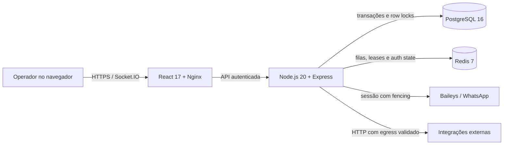

<p align="center">
  
</p>

<p align="center">
  <a href="./CHANGELOG.md"></a>
  <a href="https://github.com/gabpitthan/konnex-whitelabel/actions/workflows/quality.yml"></a>
  <a href="./backend/Dockerfile"></a>
  <a href="./compose.yaml"></a>
  <a href="./compose.yaml"></a>
</p>

<p align="center">
  <a href="#estado-do-projeto">Estado</a> ·
  <a href="#capacidades">Capacidades</a> ·
  <a href="#arquitetura">Arquitetura</a> ·
  <a href="#execução-local">Instalação</a> ·
  <a href="#qualidade">Qualidade</a> ·
  <a href="./docs/project/ROADMAP.md">Roadmap</a> ·
  <a href="./SECURITY.md">Segurança</a>
</p>

---

Central multicanal whitelabel para atendimento, campanhas e automação via
WhatsApp, evoluída com foco explícito em isolamento multiempresa,
confiabilidade operacional e escala.

O Konnex Whitelabel reúne caixa de entrada, contatos, equipes, filas,
agendamentos, campanhas, FlowBuilder, API externa e gestão de conexões em uma
única operação. Este repositório não trata o legado como concluído: o estado
validado, as limitações e os próximos riscos ficam versionados junto com o
código.

| Integridade primeiro | Escala com evidência | Estado verificável |
|:---|:---|:---|
| Tenant, transação, idempotência e rollback fazem parte do contrato. | Índices, cache e pools só mudam depois de medição representativa. | Cada versão registra testes, runtime, limitações e próximo risco. |

## Estado do projeto

- **Publicada:** versão `1.35`, com 62 suítes / 237 testes, builds, deploy e
  verificação em produção aprovados.
- **Entrega recente:** fechamento de vazamento entre empresas — duas rotas de
  relatório respondiam sem autenticação e liam `companyId` da query, e três
  endpoints da API externa dependiam de um token global em vez da credencial
  por empresa. Ver [1.33](./docs/versions/1.33/README.md).
- **Identidade de contato:** a 1.32 passou a resolver o telefone real quando o
  WhatsApp entrega LID, em todos os caminhos que criavam contato.
- **Operação real ainda necessária:** mídia, grupos e reconexão com conta
  canário. Envio, recebimento, ACK e reconexão pós-restart já foram provados.
- **Isolamento multiempresa (SEC-001):** testado com **duas empresas reais** na
  1.34. Leitura estava protegida; escrita e exclusão não estavam e foram
  fechadas. `scripts/tenant-isolation-test.sh` é a regressão viva — cria uma
  empresa-alvo descartável, ataca, e se limpa.
- **Planos:** as flags de funcionalidade do plano passam a ser impostas no
  backend (1.35). Antes eram decorativas — uma empresa num plano sem campanhas
  criava campanha com HTTP 200. Quem revende agora consegue vender planos
  diferenciados.
- **Instalação:** a aplicação não sobe com segredo ausente ou de exemplo. O
  código herdado tinha `JWT_SECRET || "mysecret"`, e esquecer essa variável
  entregava a autenticação inteira em silêncio.
- **Licença:** MIT, preservando o copyright do Whaticket (`canove`, 2020). A MIT
  autoriza a venda, mas exige o aviso preservado.
- **Code health:** os quatro gates do ENGINEERING OS (carga, cobertura,
  complexidade, dependências) rodam por `scripts/code-health.sh`. Carga e grafo
  de dependências ainda não têm ferramenta instalada e são reportados como
  NAO MEDIDO — gate não medido nunca conta como aprovado.
- **Escala horizontal:** permanece bloqueada por desenho onde o fencing ainda
  não alcançou todas as mutações de domínio.

Consulte o [estado canônico](./PROJECT_STATE.md), o
[roadmap](./docs/project/ROADMAP.md), os
[problemas conhecidos](./docs/project/ISSUES.md) e o
[changelog](./CHANGELOG.md). Alegações de conclusão exigem evidência nesses
documentos.

## Capacidades

| Área | O que existe hoje |
|---|---|
| Atendimento | tickets, mensagens, filas, equipes, tags e chat interno |
| WhatsApp | QR, sessões, auth state Redis, lease e fencing progressivo |
| Campanhas | listas, confirmação, envio em fases, UUID/CAS e recuperação bounded |
| Automação | FlowBuilder, respostas rápidas, prompts e integrações |
| API | credenciais por tenant, digest, rotação, revogação e rate limit |
| Operação | readiness/liveness, shutdown coordenado, DLQ, backup e observabilidade PostgreSQL |
| Segurança | isolamento por `companyId`, redaction, proteção SSRF/DNS rebinding e budgets HTTP |

## Arquitetura



O backend é a fronteira obrigatória de autorização. Toda consulta ou mutação
multiempresa deve carregar `companyId`; Redis não substitui o PostgreSQL como
fonte de integridade. Veja a [arquitetura operacional](./docs/project/ARCHITECTURE.md)
e as [decisões registradas](./docs/decisions/).

## Execução local

### Pré-requisitos

- Docker Engine recente;
- Docker Compose v2;
- Git;
- portas locais `3007` e `8090` disponíveis, ou ajuste explícito no compose.

### Instalação

```bash
git clone https://github.com/gabpitthan/konnex-whitelabel.git
cd konnex-whitelabel
./instalar.sh
```

O instalador faz **quatro perguntas** — domínio do painel, domínio da API,
e-mail e senha do administrador — e gera o resto: os dez segredos criptográficos,
o `.env` com permissão `600` e um `Caddyfile` para HTTPS automático.

Antes de subir ele confere Docker, memória, disco e portas. Depois de subir,
verifica de verdade: versão da API, banco e Redis conectados, painel
respondendo e **login do administrador funcionando**. Se o login falhar, ele
falha — em vez de dizer "instalado" com o banco vazio.

Faltam dois passos manuais, que dependem de DNS: apontar os dois domínios para
o servidor e ativar o Caddy com o arquivo já gerado.

Instalação manual, se preferir controlar cada variável:

```bash
cp .env.example .env      # preencha os CHANGE_ME
docker compose config --quiet
RUN_DB_SEEDS=true docker compose up --build -d
```

A aplicação **não sobe** com segredo ausente ou com valor de exemplo, e a
mensagem de erro ensina a gerar um forte.

Por padrão, o painel fica em `http://127.0.0.1:8090` e a API em
`http://127.0.0.1:3007`. PostgreSQL e Redis permanecem apenas na rede interna
do compose.

## Qualidade

O gate versionado verifica sincronização de versões, arquivos sensíveis,
configuração Docker, testes P0 e builds reproduzíveis:

```bash
scripts/preflight.sh
scripts/quality-gate.sh
scripts/code-health.sh          # carga, cobertura, complexidade, dependências
scripts/tenant-isolation-test.sh # ataque real entre duas empresas
```

`code-health.sh` mede o que a base tem ferramenta para medir e reporta
`NAO MEDIDO` com o motivo para o resto: **gate não medido nunca conta como
aprovado**. `tenant-isolation-test.sh` cria uma empresa-alvo descartável, tenta
ler, alterar e apagar os dados dela a partir de outra empresa, e se limpa —
rodar a cada lote que toque autorização, serviço de domínio ou rota autenticada.

Mudanças de banco exigem backup, restauração isolada, `up/down/up`, prova com
dado sintético e plano de rollback. Mudanças de interface exigem navegação
desktop/mobile, console/rede e estados de erro/vazio/loading. A definição
completa está em [CLAUDE.md](./CLAUDE.md), seção "Definição de pronto".

## Organização do repositório

```text
backend/             API, domínio, workers, models e migrations
frontend/            interface React (design system do ADR-0004)
docs/project/        estado, arquitetura, roadmap, issues, testes e runbook
docs/research/       pesquisa técnica e evidências para decisões
docs/versions/       relatório imutável de cada subversão
docs/decisions/      ADRs arquiteturais
scripts/             preflight, quality gate e rotinas operacionais seguras
tasks/               critérios e resultado do lote ativo
```

## Segurança e contribuição

Não abra issue pública contendo tokens, telefones, mensagens, dumps ou detalhes
de uma instalação real. Use as orientações de [SECURITY.md](./SECURITY.md).
Para propor mudanças, leia [CONTRIBUTING.md](./CONTRIBUTING.md) e mantenha o
escopo tenant-aware, transacional e mensurável.

## Licenciamento

A visibilidade pública deste código não concede automaticamente licença de
uso, redistribuição ou exploração comercial. Uma licença explícita ainda não
foi escolhida pelo mantenedor; até lá, todos os direitos permanecem reservados.
