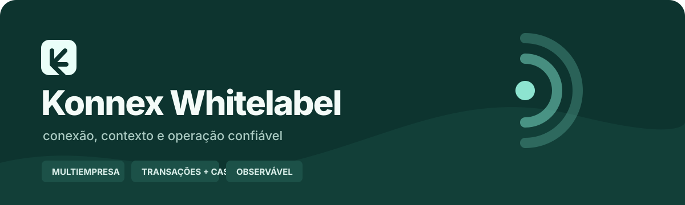
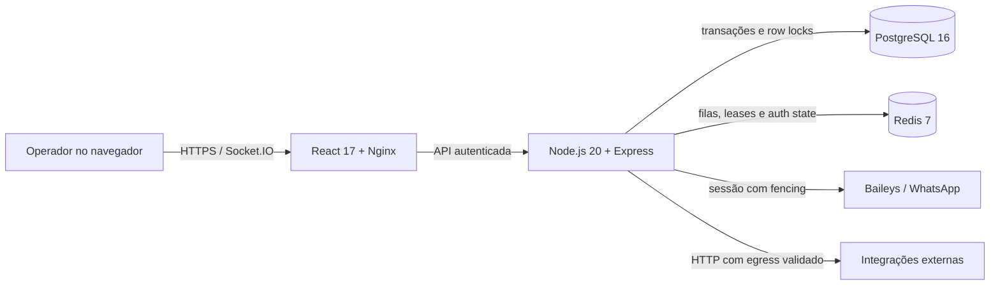

<p align="center">
  
</p>

<p align="center">
  <a href="./CHANGELOG.md"></a>
  <a href="https://github.com/gabpitthan/konnex-whitelabel/actions/workflows/quality.yml"></a>
  <a href="./backend/Dockerfile"></a>
  <a href="./compose.yaml"></a>
  <a href="./compose.yaml"></a>
</p>

<p align="center">
  <a href="#estado-do-projeto">Estado</a> ·
  <a href="#capacidades">Capacidades</a> ·
  <a href="#arquitetura">Arquitetura</a> ·
  <a href="#execução-local">Instalação</a> ·
  <a href="#qualidade">Qualidade</a> ·
  <a href="./docs/project/ROADMAP.md">Roadmap</a> ·
  <a href="./SECURITY.md">Segurança</a>
</p>

---

Central multicanal whitelabel para atendimento, campanhas e automação via
WhatsApp, evoluída com foco explícito em isolamento multiempresa,
confiabilidade operacional e escala.

O Konnex Whitelabel reúne caixa de entrada, contatos, equipes, filas,
agendamentos, campanhas, FlowBuilder, API externa e gestão de conexões em uma
única operação. Este repositório não trata o legado como concluído: o estado
validado, as limitações e os próximos riscos ficam versionados junto com o
código.

| Integridade primeiro | Escala com evidência | Estado verificável |
|:---|:---|:---|
| Tenant, transação, idempotência e rollback fazem parte do contrato. | Índices, cache e pools só mudam depois de medição representativa. | Cada versão registra testes, runtime, limitações e próximo risco. |

## Estado do projeto

- **Publicada:** versão `1.31`, com 59 suítes / 217 testes, builds, deploy,
  smoke e restart aprovados. O webhook configurável usa egress SSRF-safe e a
  árvore runtime sem suporte do `request` foi removida.
  smoke e restart aprovados.
- **Entrega recente:** remoção do Bull Board legado desativado, reduzindo o
  backend runtime de 76/9 críticas para 72/7 críticas sem alterar as filas.
- **Operação real ainda necessária:** pareamento, envio, recebimento, mídia e
  reconexão com conta WhatsApp canário.
- **Escala horizontal:** permanece bloqueada por desenho onde o fencing ainda
  não alcançou todas as mutações de domínio.

Consulte o [estado canônico](./PROJECT_STATE.md), o
[roadmap](./docs/project/ROADMAP.md), os
[problemas conhecidos](./docs/project/ISSUES.md) e o
[changelog](./CHANGELOG.md). Alegações de conclusão exigem evidência nesses
documentos.

## Capacidades

| Área | O que existe hoje |
|---|---|
| Atendimento | tickets, mensagens, filas, equipes, tags e chat interno |
| WhatsApp | QR, sessões, auth state Redis, lease e fencing progressivo |
| Campanhas | listas, confirmação, envio em fases, UUID/CAS e recuperação bounded |
| Automação | FlowBuilder, respostas rápidas, prompts e integrações |
| API | credenciais por tenant, digest, rotação, revogação e rate limit |
| Operação | readiness/liveness, shutdown coordenado, DLQ, backup e observabilidade PostgreSQL |
| Segurança | isolamento por `companyId`, redaction, proteção SSRF/DNS rebinding e budgets HTTP |

## Arquitetura



O backend é a fronteira obrigatória de autorização. Toda consulta ou mutação
multiempresa deve carregar `companyId`; Redis não substitui o PostgreSQL como
fonte de integridade. Veja a [arquitetura operacional](./docs/project/ARCHITECTURE.md)
e as [decisões registradas](./docs/decisions/).

## Execução local

### Pré-requisitos

- Docker Engine recente;
- Docker Compose v2;
- Git;
- portas locais `3007` e `8090` disponíveis, ou ajuste explícito no compose.

### Instalação

```bash
git clone https://github.com/gabpitthan/konnex-whitelabel.git
cd konnex-whitelabel
cp .env.example .env
```

Preencha todos os valores `CHANGE_ME` do `.env`. Gere segredos independentes e
longos; nunca reutilize tokens de produção nem versione o arquivo.

```bash
docker compose config --quiet
docker compose up --build -d
docker compose ps
```

Por padrão, o painel fica em `http://127.0.0.1:8090` e a API em
`http://127.0.0.1:3007`. PostgreSQL e Redis permanecem apenas na rede interna
do compose.

## Qualidade

O gate versionado verifica sincronização de versões, arquivos sensíveis,
configuração Docker, testes P0 e builds reproduzíveis:

```bash
scripts/preflight.sh
scripts/quality-gate.sh
```

Mudanças de banco exigem backup, restauração isolada, `up/down/up`, prova com
dado sintético e plano de rollback. Mudanças de interface exigem navegação
desktop/mobile, console/rede e estados de erro/vazio/loading. A definição
completa está em [DEFINITION_OF_DONE.md](./docs/DEFINITION_OF_DONE.md).

## Organização do repositório

```text
backend/             API, domínio, workers, models e migrations
frontend/            interface React e identidade Konnex Signal
docs/project/        estado, arquitetura, roadmap, issues, testes e runbook
docs/research/       pesquisa técnica e evidências para decisões
docs/versions/       relatório imutável de cada subversão
docs/decisions/      ADRs arquiteturais
scripts/             preflight, quality gate e rotinas operacionais seguras
tasks/               critérios e resultado do lote ativo
```

## Segurança e contribuição

Não abra issue pública contendo tokens, telefones, mensagens, dumps ou detalhes
de uma instalação real. Use as orientações de [SECURITY.md](./SECURITY.md).
Para propor mudanças, leia [CONTRIBUTING.md](./CONTRIBUTING.md) e mantenha o
escopo tenant-aware, transacional e mensurável.

## Licenciamento

A visibilidade pública deste código não concede automaticamente licença de
uso, redistribuição ou exploração comercial. Uma licença explícita ainda não
foi escolhida pelo mantenedor; até lá, todos os direitos permanecem reservados.
